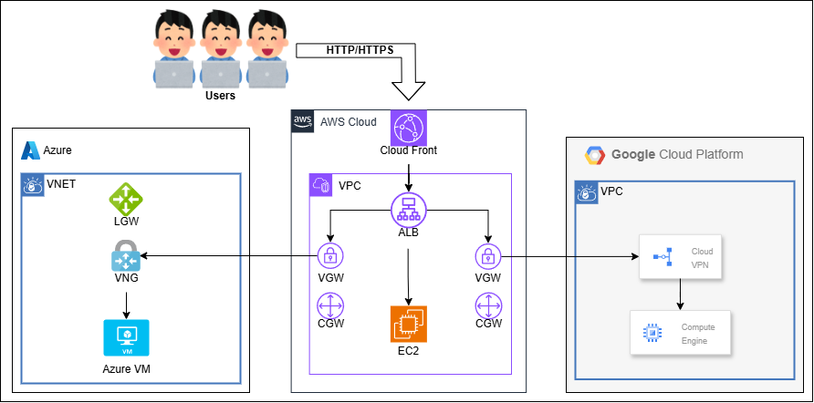

# multi-cloud-demo-app
AWS - Azure / AWS - Google Cloud を相互にVPNで接続した、
マルチクラウド環境を構築するためのterraformです。

## インフラ構成図
<p>

</p>

## 事前準備
Terraform を実行するときに使用する認証情報を用意してください。
このリポジトリでは以下の認証情報を想定しています。

* AWS - [IAM User](https://docs.aws.amazon.com/ja_jp/cli/v1/userguide/cli-authentication-user.html)
* Azure - [Service Principal](https://learn.microsoft.com/ja-jp/cli/azure/authenticate-azure-cli-service-principal)
* Goolge Cloud - [Service Account](https://cloud.google.com/iam/docs/creating-managing-service-account-keys?hl=ja#iam-service-account-keys-create-console)

## ローカルで実行する場合

* 認証情報 設定
```
mkdir ./.secret
```
```
cat << EOL > ./.secret/setting.sh
#!/bin/bash
# AWS Credential
export AWS_ACCESS_KEY_ID="<aws_access_key_id>"
export AWS_SECRET_ACCESS_KEY="<aws_secret_access_key>"

# Azure Credential
export ARM_SUBSCRIPTION_ID="<arm_subscription_id>"
export ARM_CLIENT_ID="<arm_client_id>"
export ARM_CLIENT_SECRET="<arm_client_secret>"
export ARM_TENANT_ID="<arm_tenant_id>"

# Google Cloud Credential
export GOOGLE_APPLICATION_CREDENTIALS="../../.secret/application_default_credentials.json"
EOL
```
```
# GCP Service Account 
vi ./.secret/application_default_credentials.json
```
```
source ../../.secret/setting.sh
```

* Terraform 実行
```
cd ./app/examples
```
```
terraform init && \
terraform apply
```

## コンテナで実行する場合

* 認証情報 設定
```
mkdir ./.secret
```
```
cat << EOL > ./.secret/.env
# AWS Credential
AWS_ACCESS_KEY_ID="<aws_access_key_id>"
AWS_SECRET_ACCESS_KEY="<aws_secret_access_key>"

# Azure Credential
ARM_SUBSCRIPTION_ID="<arm_subscription_id>"
ARM_CLIENT_ID="<arm_client_id>"
ARM_CLIENT_SECRET="<arm_client_secret>"
ARM_TENANT_ID="<arm_tenant_id>"

# Google Cloud Credential
GOOGLE_APPLICATION_CREDENTIALS="/root/.config/application_default_credentials.json"
EOL
```
```
# GCP Service Account 
vi ./.secret/application_default_credentials.json
```

* コンテナ 実行
```
### Build and Run
cd ./docker
docker compose --env-file ../.secret/.env up -d

### Login
docker exec -it terraform-container /bin/bash
```

* Terraform 実行
```
cd ./app/examples
```
```
terraform init && \
terraform apply
```

* CLIツール認証
```
az login
gcloud auth login
```

* 片付け
```
terraform destroy
```
```
docker compose down
```
